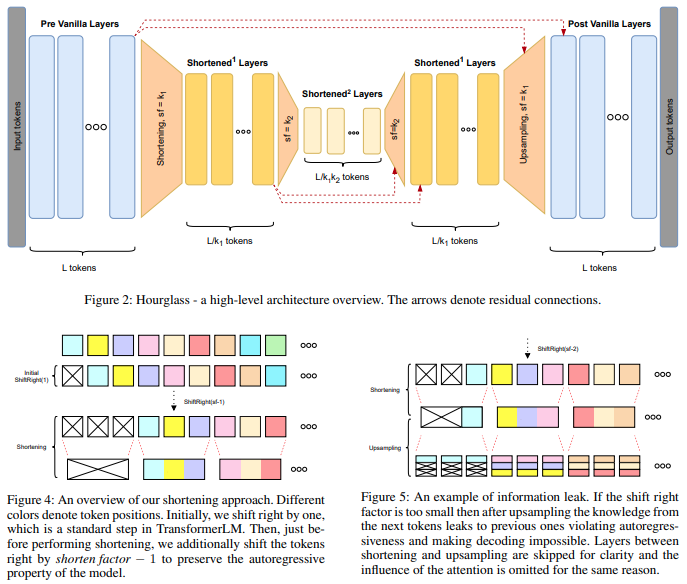

</img>

## Hourglass Transformer - Pytorch (wip)

Implementation of <a href="https://arxiv.org/abs/2110.13711">Hourglass Transformer</a>, in Pytorch. It will also contain some of my own ideas about how to make it work better.

## Citations

```bibtex
@misc{nawrot2021hierarchical,
    title   = {Hierarchical Transformers Are More Efficient Language Models}, 
    author  = {Piotr Nawrot and Szymon Tworkowski and Michał Tyrolski and Łukasz Kaiser and Yuhuai Wu and Christian Szegedy and Henryk Michalewski},
    year    = {2021},
    eprint  = {2110.13711},
    archivePrefix = {arXiv},
    primaryClass = {cs.LG}
}
```
